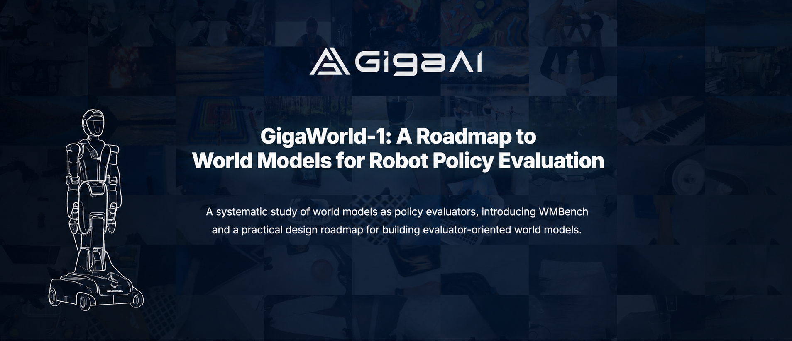

<p align="center">
  
</p>

# Giga-World-1 Example Data

This directory provides example assets and toy datasets for testing the GigaWorld-1 inference, data pipeline, and model training workflow.

## Directory Structure

```text
example/
├── infer_assest/                # Inference / rollout assets
│   ├── control_video.mp4
│   └── input_image.png
├── toy_datapipeline_dataset/    # Raw LeRobot-format toy dataset
│   ├── gt/
│   ├── depth/
│   ├── plucker/
│   ├── sketch/
│   └── labels/
└── toy_train_dataset/           # Model training data
    ├── nano/
    │   ├── dataset_cache.pkl
    │   └── episode_*.pt
    └── pro/
        ├── dataset_cache.pkl
        └── episode_*.pt
```

## Contents

### `infer_assest/` — Inference Assets

Assets used for quick testing of the image-to-video inference / rollout pipeline.

- `input_image.png`: input image (used as the first frame) for image-to-video generation.
- `control_video.mp4`: control video used by the example inference pipelines.

### `toy_datapipeline_dataset/` — Raw LeRobot Dataset

A compact robot video dataset shipped in the **raw LeRobot data format**, which can be visualized directly with the [LeRobot](https://github.com/huggingface/lerobot) visualization tools.

<p align="center">
  
</p>

Dataset structure:

```text
example/toy_datapipeline_dataset/
├── gt/                          # RGB videos (ground truth)
│   ├── cam_high/                # head view
│   ├── cam_left_wrist/          # left wrist view
│   └── cam_right_wrist/         # right wrist view
├── depth/                       # Depth Anything V2 outputs
│   ├── cam_high/
│   ├── cam_left_wrist/
│   └── cam_right_wrist/
├── plucker/                     # Plücker coordinate control signals (left/right per view)
│   ├── episode_000001_left_direction.mp4
│   ├── episode_000001_left_moment.mp4
│   ├── episode_000001_right_direction.mp4
│   └── episode_000001_right_moment.mp4
├── sketch/                      # sketch control signals
│   └── cam_high/
└── labels/
    ├── data.pkl                 # per-episode metadata
    └── config.json
```

Each record in `labels/data.pkl` follows this structure:

```python
{
    "action": List[List[float]],                    # end-effector / joint actions
    "data_index": int,
    "episode_name": str,

    "cam_high_video_path": str,
    "cam_left_wrist_video_path": str,
    "cam_right_wrist_video_path": str,

    "cam_high_depth_path": str,
    "cam_left_wrist_depth_path": str,
    "cam_right_wrist_depth_path": str,

    "qpos": List[List[float]],                      # current joint angles
    "video_height": int,
    "video_width": int,
    "video_length": int,

    "short-prompt": {                               # from meta/episodes.jsonl
        "task1": {
            "start_idx": "0",
            "end_idx": "299",
            "description": "put banana into basket"
        }
    },

    "long-prompt": {                                # generated by Qwen3-VL on cam_high
        "long prompt 1": {
            "start_idx": "0",
            "end_idx": "299",
            "caption": "The robot arm reaches toward ..."
        }
    }
}
```

### `toy_train_dataset/` — Model Training Data

Model training data for the GigaWorld-1 training workflow. This dataset is prepared for directly validating the model training pipeline on a small-scale example.

Dataset structure:

```text
example/toy_train_dataset/
├── nano/                        # nano-scale toy training split
│   ├── dataset_cache.pkl        # cached dataset index / metadata for fast loading
│   ├── episode_000000_4834c0369d_s000000_e000129_0-129_121_480_1920.pt
│   ├── episode_000000_4834c0369d_s000129_e000258_0-129_121_480_1920.pt
│   └── ...
└── pro/                         # pro-scale toy training split
    ├── dataset_cache.pkl        # cached dataset index / metadata for fast loading
    ├── episode_000000_453e4c570c_s000000_e000129_0-129_121_480_1920.pt
    ├── episode_000001_7473d389a6_s000000_e000129_0-129_121_480_1920.pt
    ├── episode_000002_8436313f94_s000000_e000129_0-129_121_480_1920.pt
    └── ...
```

- `nano/`: a smaller toy training split for quick debugging and smoke tests.
- `pro/`: a larger toy training split for validating the full training data loader.
- `dataset_cache.pkl`: cached metadata / dataset index used by the training pipeline.
- `episode_*.pt`: preprocessed training samples. The filename records the source episode id, segment range, frame range, and spatial resolution.

## Usage

Use these files with the main GigaWorld-1 repository scripts.

Example paths:

```bash
EXAMPLE_ROOT=/path/to/example
INFER_ASSETS=$EXAMPLE_ROOT/infer_assest
TOY_PIPELINE_DATASET=$EXAMPLE_ROOT/toy_datapipeline_dataset
TOY_TRAIN_DATASET=$EXAMPLE_ROOT/toy_train_dataset
```

Refer to the main project README for detailed commands covering data preparation, inference, visualization, and training.

## Acknowledgements

We sincerely thank the open-source community and the projects that make this work possible.

<p align="center">
  <a href="https://github.com/huggingface/diffusers">
    
  </a>
  <a href="https://github.com/huggingface/lerobot">
    
  </a>
  <a href="https://huggingface.co/">
    
  </a>
  <a href="https://modelscope.cn/">
    
  </a>
  <a href="https://pytorch.org/">
    
  </a>
</p>

Thanks also to many other open-source contributors for their tools, models, and community support.

## License

This example data is released under the Apache License 2.0 unless otherwise specified.
